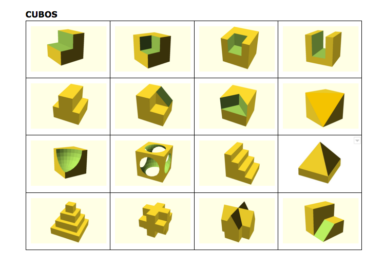
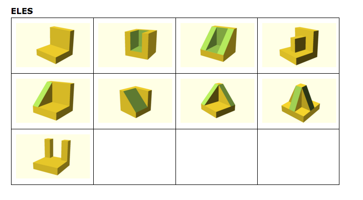

# OpenSCAD-PiezasDibujo
A library of 3D printable open source pieces to learn to draw designed in OpenSCAD

# License:

The designs OpenSCAD-Piezas de Dibujo are licensed under [Creative Commons Attribution-ShareAlike 4.0 International License](http://creativecommons.org/licenses/by-sa/4.0/)

# Contribute

Please, do not hesitate on contributing to this library
  
# Criterios usado en el diseño de las piezas:
- Se ha intentado hacer las piezas lo más sencillas posibles para que sirvan para aprender a hacer vistas y perspectivas.
- Las piezas tienen una medida estándar de 40x40x40, intentando encontrar el equilibrio entre economía de material, tiempo de impresión y espacio de  almacenaje y que sean funcionales.
- Se ha intentando que las medidas de los elementos de las piezas sean múltiplos de 10 mm para que así sean más fáciles de acotar
- Se ha intentado que las piezas tengan cierta simetría y estética

# Series
Se han organizado las piezas en series.
- Serie Cubo:
Las piezas se podrían obtener a partir de un cubo seccionando algunas de las partes.

- Serie Eles:
Las piezas son derivaciones a partir de reforzar una L

- Serie Cilindros:
Las piezas se obtienen con el cilindro como forma o como elemento sustractivo

# Archivos

De cada pieza hay 3 archivos:
- .scad con el código de openscad 
- .stl con el 3d 
- .png una imagen 

